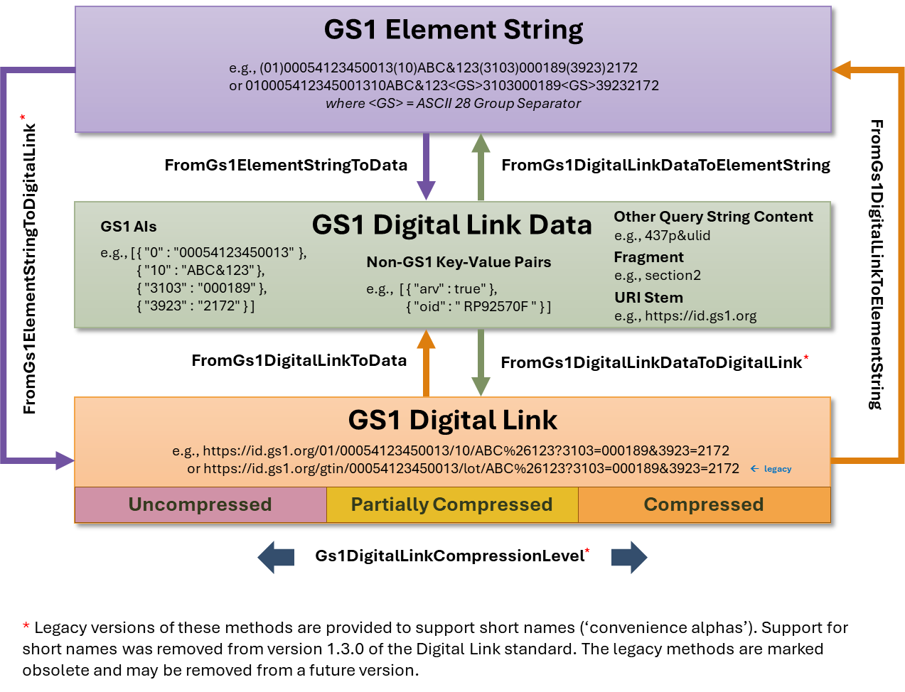

# Gs1DigitalLinkLib for .NET

This .NET library translates between GS1 element strings and GS1 Digital Link URIs. It includes reversible compression functions, as defined in the [GS1 Digital Link standard](https://www.gs1.org/standards/gs1-digital-link). Please note the [legal disclaimer](https://ref.gs1.org/gs1/standards-disclaimer/) that applies to all GS1 standards.

The GS1 Digital Link Library for .NET is a port of the [GS1 Digital Link Compression Prototype](https://github.com/gs1/GS1DigitalLinkCompressionPrototype), provided by GS1 and written in JavaScript. This, in turn, is an extended version of the [GS1 Digital Link Toolkit](https://github.com/gs1/GS1DigitalLinkToolkit.js) . To differentiate our .NET (C#) code from the GS1 Digital Link Toolkit, we’ve named it the ‘GS1 Digital Link Library for .NET’, deliberately dropping the term ‘Toolkit’ to avoid any misperception regarding its relationship to the GS1 Toolkit. There is no formal relationship. However, it provides a functional superset of the GS1 Digital Link Toolkit. In addition to supporting compression and decompression, the functionality has been streamlined and extended. It is presented in a form that naturally supports common .NET idioms.

# Introduction

The GS1 identification system is widely used worldwide within product barcodes, as well as within barcodes for shipments, assets, locations, etc.

Further information about GS1 can be found at <https://www.gs1.org>.

Details about the GS1 identification system and GS1 Application Identifiers can be found in the GS1 General Specifications at <https://ref.gs1.org/standards/genspecs/> and a searchable list of GS1 Application Identifiers is at <https://ref.gs1.org/ai/?lang=en>.

GS1 Digital Link is a Web URI syntax for expressing GS1 Application Identifiers and their values in a Web-friendly format. This makes it easier to connect identifiers of products, shipments, locations, assets etc. to related online information and services on the Web via simple Web redirects using Web resolver infrastructure.

The GS1 Digital Link syntax is defined in <https://ref.gs1.org/standards/digital-link/uri-syntax/>

A GS1 Digital Link demonstration tool is available at <https://id.gs1.org/uritool>.

# Overview

This GS1 Digital Link Library provides seven translation methods, as indicated in the overview diagram below:



These methods provide the same functionality as the ten methods provided by the [GS1 Digital Link Compression Prototype](https://github.com/gs1/GS1DigitalLinkCompressionPrototype). However, the Library views compression and partial compression as different forms of an uncompressed Digital Link and supports transitions between these three forms through a single method. In addition, the library eliminates any need to first decompress a Digital Link before extracting data from it or converting it to an element string. Decompression is performed automatically. Similarly, an element string or a data representation of a Digital Link can be transformed into a Digital Link in any of the three forms through a single method call.

All seven methods are implemented as static methods of the **Gs1DigitalLinkConvert** class. They can be used as global methods operating over the data. Alternatively, you can use extension methods. For example, the following calls in C# to populate elementString1 and elementString2 are equivalent:

```cs
using Solidsoft.Reply.Gs1DigitalLinkLib;

...

string digitalLink = "https://id.gs1.org/01/05412345000013";

Gs1ElementString elementString1 = Gs1DigitalLinkConvert.FromGs1DigitalLinkToGs1ElementString(digitalLink);

Gs1ElementString elementString2 = digitalLink.ToGs1ElementString();
```

# Installation

You can install the Solidsoft Reply GS1 Digital Link Library for .NET using the following NuGet command:

nuget Install-Package Solidsoft.Reply.Gs1DigitalLinkLib

# Basic Usage

Import Solidsoft.Reply.Gs1DigitalLinkLib with a using directive.

## Classes

The library provides three classes to represent Digital Link data:

**GS1DigitalLink** – represents a Digital Link URI.

**GS1DigitalLinkData** – represents the data in a GS1 Digital Link. This plays an equivalent role to the associative array of GS1 Application Identifiers in the GS1 Digital Link Toolkit but has been extended to provide additional information including non-GS1 key-value pairs, any components of the Query String that are not key-value pairs, and any fragment specifier.  The class also provides the URI stem and a structured list of GS1 AIs categorised as Digital Link identifiers, quantifiers and data attributes.

**GS1ElementString** – a representation of the GS1 data in a Digital Link URI, either in FNC1 format (as reported by a barcode scanner) or as a formatted string in which each AI is enclosed in parenthesis.

The seven core methods provided by **Gs1DigitalLinkConvert** and their equivalent extension methods are:

<table>
  <tr>
    <th>Gs1DigitalLinkConvert Method</th>
    <th>Extension Method</th>
    <th>Description</th>
  </tr>
  <tr>
    <td>FromGs1ElementStringToDigitalLink()</td>
    <td rowspan=2 valign="top">ToGs1DigitalLink()</td>
    <td valign="top">Translates a GS1 element string into a Digital Link.</td>
  </tr>
  <tr>
    <td colspan=2>FromGs1DigitalLinkDataToDigitalLink()</td>
    <td>Translates GS1 Digital Link data into a Digital Link.</td>
  </tr>
  <tr>
    <td>FromGs1DigitalLinkToElementString()</td>
    <td rowspan=2 valign="top">ToGs1ElementString()</td>
    <td valign="top">Translates a GS1 Digital Link to an element string.</td>
  </tr>
  <tr>
    <td colspan=2>FromGs1DigitalLinkDataToElementString()</td>
    <td>Translates GS1 Digital Link data to an element string.</td>
  </tr>
  <tr>
    <td>FromGs1ElementStringToDigitalLinkData()</td>
    <td rowspan=2 valign="top">ToGs1DigitalLinkData()</td>
    <td valign="top">Translates a GS1 element string to data.</td>
  </tr>
  <tr>
    <td colspan=2>FromGs1DigitalLinkToData()</td>
    <td>Translates a GS1 Digital Link to data.</td>
  </tr>
  <tr>
    <td>Gs1DigitalLinkCompressionLevel()</td>
    <td rowspan=2 valign="top">ChangeGs1CompressionLevel()[string, Uri]<br/>ChangeCompressionLevel()[Gs1DigitalLink]</td>
    <td valign="top">Changes the compression level of a GS1 Digital Link.</td>
  </tr>
</table>
<hr></br>
The extension methods extend the following types:

* Gs1DigitalLink
* Gs1DigitalLinkData
* Gs1ElementString
* string
* Uri
* IReadOnlyDictionary<read, read>

N.B. the ToGs1DigitalLinkData() extension method first attempts to interpret a string as a GS1 Digital Link. If this fails, it attempts to interpret the string as an element string. If this fails it returns the exception thrown when it first tried to interpret the string as a Digital Link.

## Translate a GS1 element string to a GS1 Digital Link

The method **FromGs1ElementStringToDigitalLink()**, or the equivalent extension method **ToGs1DigitalLink()**, converts a **GS1ElementString** object or string to a **GS1DigitalLink** object. The method is overloaded and takes the following parameters:

* **elementString** [Gs1ElementString], or **gs1ElementString** [string]

A **GS1ElementString** object or string representing a concatenation of one or more GS1 elements. An element string can be represented in one of two forms:

* 1. in ‘bracket’ notation. Barcode creation libraries often use bracket notation or some close equivalent as input. In this form, each GS1 Application Identifier is enclosed in round brackets, e.g.

     "(3103)000189(01)05412345000013(3923)2172(10)ABC&+123"
  2. in FNC1 form. This is the form in which barcode data is reported by a barcode scanner when scanning barcodes that contain GS1 AI data. In this form a Group Separator character (ASCII character 29 decimal) is used as a delimiter marking the end of any penultimate data value where that data value does not have a predefined length in the GS1 General Specifications standard. NB., the list of AIs with predefined value lengths is fixed and is a subset of the AIs that have fixed width values. For any AI that does not appear in this list, the AI key-value pair is generally terminated by a special code (an FNC1) in the barcode which must be reported as Group Separator by the barcode scanner. Terminators are not used for the final AI key-value pair reported by the barcode scanner.
* **uriStem**

Use this to specify a stem with a specific domain name. If omitted, the library uses <https://id.gs1.org> as the default.

* **digitalLinkForm**

Use this to specify the desired level of compression for the Digital Link. Options include ‘uncompressed’, ‘partially compressed’ and ‘compressed’.

* **useOptimisations**

Set this to true to request additional optimisations for compressed digital links. This only applies to compressed digital links where additional optimisations are available.

* **nonGs1KeyValuePairs**

Use this to pass a dictionary of additional non-GS1 key-value pairs. These will be added to the Digital Link query string.

* **compressNonGs1KeyValuePairs**

Set this to true to allow the library to compress non-GS1 key-value pairs.

* **otherQueryContent**

Use this to pass any additional query string content. You would normally use this to pass query string components that are not key-value pairs. However, the library will analyse your input and detect any key-value pairs that it contains. N.B., content that is not in the for of key-value pairs is not compressed.

* **fragment**

Use this to pass a fragment specifier for including in the Digital Link URI. NB., fragments are not compressed.

**Return Value**

This method returns a **Gs1DigitalLink** object representing a GS1 Digital Link.

**Example**

```cs
using Solidsoft.Reply.Gs1DigitalLinkLib;

var elementString = "(3103)000189(01)05412345000013(3923)2172(10)ABC&+123";

try {
    var gs1DigitalLink = elementString.ToGs1DigitalLink(uriStem: "http://example.org");

    Console.WriteLine($"Digital Link URI = '{gs1DigitalLink}'");
    // Digital Link URI = 'http://example.org/01/05412345000013/10/ABC%26%2B123?3103=000189&3923=2172'
}
catch (Exception ex) {
    Console.WriteLine(ex);
}
```
```cs

using Solidsoft.Reply.Gs1DigitalLinkLib;

var elementStringFnc1 = $"3103000189010541234500001339232172{DataResources.GroupSeparator}10ABC&+123";

try {
    var gs1DigitalLink = elementStringFnc1.ToGs1DigitalLink(uriStem: "http://example.org");

    Console.WriteLine($"Digital Link URI = '{gs1DigitalLink}'");
    // Digital Link URI = 'http://example.org/01/05412345000013/10/ABC%26%2B123?3103=000189&3923=2172'
}
catch (Exception ex) {
    Console.WriteLine(ex);
}
```

## Translate a GS1 Digital Link URI to an element string

The method **FromGs1DigitalLinkToElementString()**, or the equivalent extension method **ToGs1ElementString()** converts a **GS1DigitalLink** object of Digital Link URI to a **Gs1ElementString** object representing concatenated GS1 elements. The method is overloaded and takes the following parameters:

* **digitalLink** [Gs1DigitalLink] or **gs1DigitalLinkUri** [string or Uri]
  Provide a representation of a valid GS1 Digital Link URI.
* **brackets**

Use this to control the format of the element string. Set to true to output the element string in bracket notation. Otherwise, the element string is output in FNS1 format.

**Return Value**

This method returns a **Gs1ElementString** representing a concatenation of one or more GS1 elements extracted from the GS1 Digital Link or Digital Link URI that was supplied as input.

**Example**

```cs
using Solidsoft.Reply.Gs1DigitalLinkLib;

var gs1DigitalLink = "http://example.org/gtin/054123450013/lot/ABC%26%2B123?3103=000189&3923=2172";

try {
    var gs1ElementString = gs1DigitalLink.ToGs1ElementString(true);

    Console.WriteLine($"Element String = '{gs1ElementString}'");
    // Element String = '(01)05412345000013(10)ABC&+123(3103)000189(3923)2172'
}
catch (Exception ex) {
    Console.WriteLine(ex);
}
```
```cs
using Solidsoft.Reply.Gs1DigitalLinkLib;

var gs1DigitalLink = "http://example.org/gtin/054123450013/lot/ABC%26%2B123?3103=000189&3923=2172";

try {
    var gs1ElementString = gs1DigitalLink.ToGs1ElementString(false);

    Console.WriteLine($"Element String = '{gs1ElementString}'");
    // Element String = '0105412345000013310300018939232172↔10ABC&+123'
}
catch (Exception ex) {
    Console.WriteLine(ex);
}
```

## Translate a GS1 element string to a data representation

The method **FromGs1ElementStringToDigitalLinkData()**, or the equivalent extension method **ToGs1DigitalLinkData()**, converts a **GS1ElementString** object or string or a concatenated string of GS1 elements to a **Gs1DigitialLinkData** object. The method is overloaded and takes the following parameters:

* **elementString** [Gs1ElementString] **or gs1ElementString** [string] A **GS1ElementString** object or string representing a concatenation of one or more GS1 elements. An element string can be represented in one of two forms:
  + in ‘bracket’ notation. Barcode creation libraries often use bracket notation or some close equivalent as input. In this form, each GS1 Application Identifier is enclosed in round brackets, e.g.

    "(3103)000189(01)05412345000013(3923)2172(10)ABC&+123"
  + in FNC1 form. This is the form in which barcode data is reported by a barcode scanner when scanning barcodes that contain GS1 AI data. In this form a Group Separator character (ASCII character 29 decimal) is used as a delimiter marking the end of any penultimate data value where that data value does not have a predefined length in the GS1 General Specifications standard. NB., the list of AIs with predefined value lengths is fixed and is a subset of the AIs that have fixed width values. For any AI that does not appear in this list, the AI key-value pair is generally terminated by a special code (an FNC1) in the barcode which must be reported as Group Separator by the barcode scanner. Terminators are not used for the final AI key-value pair reported by the barcode scanner.
* **noValidation** - If true, the GS1 element string is not validated. The Digital Link data values returned by the method may contain invalid AIs and AI values.

**Return Value**

This method returns a **Gs1DigitalLinkData** object containing a dictionary of GS1 application identifiers, non-GS1 key-vale pairs, any additional non- key-value pairs for inclusion in the query string and any fragment specifier.

**Example**

```cs
using Solidsoft.Reply.Gs1DigitalLinkLib;

var elementString = "(3103)000189(01)05412345000013(3923)2172(10)ABC&+123";

try {
    var gs1Data = elementString.ToGs1DigitalLinkData();

    Console.WriteLine($"GS1 data = {JsonSerializer.Serialize(gs1Data)}");
    // GS1 data = {"gs1AIs":{"3103":"000189","01":"05412345000013","3923":"2172","10":"ABC\u0026\u002B123"},"nonGs1KeyValuePairs":{},"otherQueryStringContent":"","fragmentSpecifier":""}
}
catch (Exception ex) {
    Console.WriteLine(ex);
}
```

## Translate a GS1 Digital Link data representation to an element string

The method **FromGs1DigitalLinkDataToElementString()**, or the equivalent  extension method **ToGs1ElementString()**, converts a **Gs1DigitalLinkData** object or a dictionary containing GS1 Application Identifiers to a **Gs1ElementString** object representing a concatenation of GS1 elements. Any additional data provided by a **Gs1DigitalLinkData** object, such as non-GS1 key-value pairs or additional query string content or fragment, is ignored. The method is overloaded and takes the following parameters:

* **digitalLinkData** [Gs1DigitalLinkData], or **gs1DigitalLinkData** [IReadOnlyDictionary]

A **Gs1DigitalLinkData** object or a dictionary (**IReadOnlyDictionary<string, string>**) containing a list of GS1 Application Identifiers and their values.

* **brackets**Use this to control the format of the element string. Set to true to output the element string in bracket notation. Otherwise, the element string is output in FNS1 format.

**Return Value**

This method returns a Gs1ElementString object representing a concatenation of one or more GS1 elements.

**Example**

```cs
using Solidsoft.Reply.Gs1DigitalLinkLib;

var gs1Data = new Dictionary<string, string> {
                  { "01", "05412345000013" },
                  { "10", "ABC&+123" },
                  { "3103", "000189" },
                  { "3923", "2172" }
              };

try {
    var gs1ElementStrings = gs1Data.ToGs1ElementString(true);

    Console.WriteLine("GS1 Element String = " + gs1ElementStrings);
    // GS1 Element String = (01)05412345000013(10)ABC&+123(3103)000189(3923)2172
}

catch (Exception ex) {
    Console.WriteLine(ex);
}
```

## Translate a GS1 Digital Link to a data representation

The method **FromGs1DigitalLinkToData()**, or the equivalent  extension method **ToGs1DigitalLinkData()**, converts a **Gs1DigitalLink** object or a string or Uri representation of the Digital Link to a **Gs1DigitalLinkData** object representing GS1 Application Identifiers, non-GS1 key-value pairs and any additional query string content or fragment. The method is overloaded and takes the following parameters:

* **digitalLink** [Gs1DigitalLink] or **digitalLinkUri** [string or Uri]
  Provide a representation of a valid GS1 Digital Link URI.

**Return Value**

This method returns a **Gs1DigitalLinkData** object containing a dictionary of GS1 application identifiers, non-GS1 key-vale pairs, any additional non- key-value pairs for inclusion in the query string and any fragment specifier.

**Example**

```cs
var gs1DigitalLinkUri = "http://example.org/gtin/054123450013/lot/ABC%26%2B123?3103=000189&3923=2172";

try {
    var gs1Data = gs1DigitalLinkUri.ToGs1DigitalLinkData();

    Console.WriteLine($"GS1 data = {gs1Data}");
    // GS1 data = {"gs1DigitalLinkData":{"3103":"000189","3923":"2172","10":"ABC\u0026\u002B123","01":"05412345000013"},"nonGs1KeyValuePairs":{},"otherQueryStringContent":"","fragmentSpecifier":""}
}
catch (Exception ex) {
    Console.WriteLine(ex);
}
```

## Translate a GS1 Digital Link data representation to a Digital Link

The method **FromGs1DigitalLinkDataToDigitalLink()**, or the equivalent  extension method **ToGs1DigitalLink()**, converts a **Gs1DigitalLinkData** object or a dictionary containing GS1 Application Identifiers to a **Gs1DigitalLink** object representing a concatenation of GS1 elements. The method is overloaded and takes the following parameters:

* **digitalLinkData** [Gs1DigitalLinkData], or **gs1DigitalLinkData** [IReadOnlyDictionary]
* **uriStem**

Use this to specify a stem with a specific domain name. If omitted, the library uses <https://id.gs1.org> as the default.

* **digitalLinkForm**

Use this to specify the desired level of compression for the Digital Link. Options include ‘uncompressed’, ‘partially compressed’ and ‘compressed’.

* **useOptimisations**

Set this to true to request additional optimisations for compressed digital links. This only applies to compressed digital links where additional optimisations are available.

* **compressNonGs1KeyValuePairs**

Set this to true to allow the library to compress non-GS1 key-value pairs.

**Return Value**

This method returns a **Gs1DigitalLink** object representing a GS1 Digital Link.

**Example**

```cs
using Solidsoft.Reply.Gs1DigitalLinkLib;

var gs1Data = new Dictionary<string, string> {
                      { "01", "05412345000013" },
                      { "10", "ABC&+123" },
                      { "3103", "000189" },
                      { "3923", "2172" }
                  };

try {
    var gs1DigitalLinkUri = gs1Data.ToGs1DigitalLink("https://example.org");

    Console.WriteLine("GS1 Digital Link URI = " + gs1DigitalLinkUri);
    // GS1 Digital Link URI = https://example.org/01/05412345000013/10/ABC%26%2B123?3103=000189&3923=2172
}
catch (Exception ex) {
    Console.WriteLine(ex);
}
```

## Change the compression level of a GS1 Digital Link

The method **Gs1DigitalLinkCompressionLevel()**, and the equivalent  extension methods **ChangeGs1CompressionLevel()** for **string** and **Uri**, and **ChangeCompressionLevel()** for **Gs1DigitalLink**, change the compression level of a GS1 Digital Link to the specified level. If the Digital Link already has the required level of compression, no conversion occurs, and no error is reported. The methods can be used to compress, partially compress or decompress, or decompress Digital Links. The methods are overloaded and take the following parameters:

* **digitalLink** [Gs1DigitalLink] or **gs1DigitalLinkUri** [string or Uri]
  Provide a representation of a valid GS1 Digital Link URI.
* **compressionLevel**

Use this to specify the desired level of compression for the Digital Link. Options include ‘uncompressed’, ‘partially compressed’ and ‘compressed’.

* **useOptimisations**

Set this to true to request additional optimisations for compressed digital links. This only applies to compressed digital links where additional optimisations are available.

* **compressNonGs1KeyValuePairs**

Set this to true to allow the library to compress non-GS1 key-value pairs.

**Return Value**

This method returns a **Gs1DigitalLink** object representing a GS1 Digital Link.

**Example**

```cs
var gs1DigitalLinkUri = "http://example.org/gtin/054123450013/lot/ABC%26%2B123?3103=000189&3923=2172";

try {
    var compressed = gs1DigitalLinkUri.ChangeGs1CompressionLevel(CompressionLevel.Compressed);
    var partiallyCompressed = compressed.ChangeCompressionLevel(CompressionLevel.PartiallyCompressed);
    var uncompressed = partiallyCompressed.ChangeCompressionLevel(CompressionLevel.Uncompressed);

    Console.WriteLine($"Compressed GS1 Digital Link = {compressed.Value}");
    Console.WriteLine($"Partially compressed GS1 Digital Link = {partiallyCompressed.Value}");
    Console.WriteLine($"Uncompressed GS1 Digital Link = {uncompressed.Value}");
    // Compressed GS1 Digital Link = http://example.org/AQAZNASdOiERBhQ0ytiyZmIGABenJGhD4
    // Partially compressed GS1 Digital Link = http://example.org/01/05412345000013/EIiDChplbFkzMQMAC9OSNCHw
    // Uncompressed GS1 Digital Link = http://example.org/01/05412345000013/10/ABC%26%2B123?3103=000189&3923=2172
}
catch (Exception ex) {
    Console.WriteLine(ex);
}
```

# Handling Legacy Short Names

**Gs1DigitalLinkConvert** implements three additional methods to handle legacy ‘short names’. Short names (“convenience alphas”) are no longer supported from version 1.1.3 of the GS1 Digital Link standard. These three methods and their equivalent extension methods are:

<table>
  <tr>
    <th>Gs1DigitalLinkConvert Method</th>
    <th>Extension Method</th>
    <th>Description</th>
  </tr>
  <tr>
    <td>FromGs1ElementStringToDigitalLinkWithShortNames()</td>
    <td rowspan=2 valign="top">ToGs1DigitalLinkWithShortNames()</td>
    <td>Translates a GS1 element string into a Digital Link.</td>
  </tr>
  <tr>
    <td colspan=2>FromGs1DigitalLinkDataToDigitalLinkWithShortNames()</td>
    <td>Translates GS1 Digital Link data into a Digital Link.</td>
  </tr>
  <tr>
    <td>Gs1DigitalLinkCompressionLevelWithShortNames()</td>
    <td>ChangeGs1CompressionLevelWithShortNames()[**string**, **Uri**]  ChangeCompressionLevelWithShortNames ()[**Gs1DigitalLink**]</td>
    <td>Changes the compression level of a GS1 Digital Link.</td>
  </tr>
</table>

## Translate a GS1 element string to a GS1 Digital Link with short names

The method **FromGs1ElementStringToDigitalLinkWithShortNames()**, or the equivalent extension method **ToGs1DigitalLinkWithShortNames()**, converts a **GS1ElementString** object or string to a **GS1DigitalLink** object. The Digital Link is expressed using legacy short names, rather than AIs. The method is overloaded and takes the following parameters:

* **elementString** [Gs1ElementString], or **gs1ElementString** [string]

A **GS1ElementString** object or string representing a concatenation of one or more GS1 elements. An element string can be represented in one of two forms:

* 1. in ‘bracket’ notation. Barcode creation libraries often use bracket notation or some close equivalent as input. In this form, each GS1 Application Identifier is enclosed in round brackets, e.g.

     "(3103)000189(01)05412345000013(3923)2172(10)ABC&+123"
  2. in FNC1 form. This is the form in which barcode data is reported by a barcode scanner when scanning barcodes that contain GS1 AI data. In this form a Group Separator character (ASCII character 29 decimal) is used as a delimiter marking the end of any penultimate data value where that data value does not have a predefined length in the GS1 General Specifications standard. NB., the list of AIs with predefined value lengths is fixed and is a subset of the AIs that have fixed width values. For any AI that does not appear in this list, the AI key-value pair is generally terminated by a special code (an FNC1) in the barcode which must be reported as Group Separator by the barcode scanner. Terminators are not used for the final AI key-value pair reported by the barcode scanner.
* **uriStem**

Use this to specify a stem with a specific domain name. If omitted, the library uses <https://id.gs1.org> as the default.

* **digitalLinkForm**

Use this to specify the desired level of compression for the Digital Link. Options include ‘uncompressed’, ‘partially compressed’ and ‘compressed’.

* **useOptimisations**

Set this to true to request additional optimisations for compressed digital links. This only applies to compressed digital links where additional optimisations are available.

* **nonGs1KeyValuePairs**

Use this to pass a dictionary of additional non-GS1 key-value pairs. These will be added to the Digital Link query string.

* **compressNonGs1KeyValuePairs**

Set this to true to allow the library to compress non-GS1 key-value pairs.

* **otherQueryContent**

Use this to pass any additional query string content. You would normally use this to pass query string components that are not key-value pairs. However, the library will analyse your input and detect any key-value pairs that it contains. N.B., content that is not in the for of key-value pairs is not compressed.

* **fragment**

Use this to pass a fragment specifier for including in the Digital Link URI. NB., fragments are not compressed.

**Return Value**

This method returns a **Gs1DigitalLink** object representing a GS1 Digital Link.

**Example**

```cs
using Solidsoft.Reply.Gs1DigitalLinkLib;

var elementString = "(3103)000189(01)05412345000013(3923)2172(10)ABC&+123";

try {
    var gs1DigitalLink = elementString.ToGs1DigitalLinkWithShortNames(uriStem: "http://example.org");

    Console.WriteLine($"Digital Link URI = '{gs1DigitalLink}'");
    // Digital Link URI = 'http://example.org/gtin/05412345000013/lot/ABC%26%2B123?3103=000189&3923=2172'
}
catch (Exception ex) {
    Console.WriteLine(ex);
}
```
```cs
using Solidsoft.Reply.Gs1DigitalLinkLib;

var elementStringFnc1 = $"3103000189010541234500001339232172{DataResources.GroupSeparator}10ABC&+123";

try {
    var gs1DigitalLink = elementStringFnc1.ToGs1DigitalLinkWithShortNames(uriStem: "http://example.org");

    Console.WriteLine($"Digital Link URI = '{gs1DigitalLink}'");
    // Digital Link URI = 'http://example.org/gtin/05412345000013/lot/ABC%26%2B123?3103=000189&3923=2172'
}

catch (Exception ex) {
    Console.WriteLine(ex);
}
```

## Translate a GS1 Digital Link data representation to a Digital Link with short names

The method **FromGs1DigitalLinkDataToDigitalLinkWithShortNames()**, or the equivalent  extension method **ToGs1DigitalLinkWithShortNames()**, converts a **Gs1DigitalLinkData** object or a dictionary containing GS1 Application Identifiers to a **Gs1DigitalLink** object representing a concatenation of GS1 elements. The Digital Link is expressed using legacy short names, rather than AIs. The method is overloaded and takes the following parameters:

* **digitalLinkData** [Gs1DigitalLinkData], or **gs1DigitalLinkData** [IReadOnlyDictionary]
* **uriStem**

Use this to specify a stem with a specific domain name. If omitted, the library uses <https://id.gs1.org> as the default.

* **digitalLinkForm**

Use this to specify the desired level of compression for the Digital Link. Options include ‘uncompressed’, ‘partially compressed’ and ‘compressed’.

* **useOptimisations**

Set this to true to request additional optimisations for compressed digital links. This only applies to compressed digital links where additional optimisations are available.

* **compressNonGs1KeyValuePairs**

Set this to true to allow the library to compress non-GS1 key-value pairs.

**Return Value**

This method returns a **Gs1DigitalLink** object representing a GS1 Digital Link.

**Example**

```cs
using Solidsoft.Reply.Gs1DigitalLinkLib;

var gs1Data = new Dictionary<string, string> {
                  { "01", "05412345000013" },
                  { "10", "ABC&+123" },
                  { "3103", "000189" },
                  { "3923", "2172" }
              };

try {
    var gs1DigitalLinkUri = gs1Data.ToGs1DigitalLinkWithShortNames("https://example.org");

    Console.WriteLine("GS1 Digital Link URI = " + gs1DigitalLinkUri);
    // GS1 Digital Link URI = https://example.org/gtin/05412345000013/lot/ABC%26%2B123?3103=000189&3923=2172
}
catch (Exception ex) {
    Console.WriteLine(ex);
}
```

## Change the compression level of a GS1 Digital Link and provide short names

The method **Gs1DigitalLinkCompressionLevelWithShortNames()**, and the equivalent  extension methods **ChangeGs1CompressionLevelWithShortNames()** for **string** and **Uri**, and **ChangeCompressionLevelWithShortNames()** for **Gs1DigitalLink**, change the compression level of a GS1 Digital Link to the specified level. If the Digital Link already has the required level of compression, no conversion occurs, and no error is reported. The methods can be used to compress, partially compress or decompress, or decompress Digital Links. The Digital Link is expressed using legacy short names, rather than AIs. The methods are overloaded and take the following parameters:

* **digitalLink** [Gs1DigitalLink] or **gs1DigitalLinkUri** [string or Uri]
  Provide a representation of a valid GS1 Digital Link URI.
* **compressionLevel**

Use this to specify the desired level of compression for the Digital Link. Options include ‘uncompressed’, ‘partially compressed’ and ‘compressed’.

* **useOptimisations**

Set this to true to request additional optimisations for compressed digital links. This only applies to compressed digital links where additional optimisations are available.

* **compressNonGs1KeyValuePairs**

Set this to true to allow the library to compress non-GS1 key-value pairs.

**Return Value**

This method returns a **Gs1DigitalLink** object representing a GS1 Digital Link.

**Example**

```cs
using Solidsoft.Reply.Gs1DigitalLinkLib;

var gs1DigitalLinkUri = "http://example.org/gtin/054123450013/lot/ABC%26%2B123?3103=000189&3923=2172";

try {
    var compressed = gs1DigitalLinkUri.ChangeGs1CompressionLevelWithShortNames(CompressionLevel.Compressed);
    var partiallyCompressed = compressed.ChangeCompressionLevelWithShortNames(CompressionLevel.PartiallyCompressed);
    var uncompressed = partiallyCompressed.ChangeCompressionLevelWithShortNames(CompressionLevel.Uncompressed);

    Console.WriteLine($"Compressed GS1 Digital Link = {compressed.Value}");
    Console.WriteLine($"Partially compressed GS1 Digital Link = {partiallyCompressed.Value}");
    Console.WriteLine($"Uncompressed GS1 Digital Link = {uncompressed.Value}");
    // Compressed GS1 Digital Link = http://example.org/AQAZNASdOiERBhQ0ytiyZmIGABenJGhD4
    // Partially compressed GS1 Digital Link = http://example.org/gtin/05412345000013/EIiDChplbFkzMQMAC9OSNCHw
    // Uncompressed GS1 Digital Link = http://example.org/gtin/05412345000013/lot/ABC%26%2B123?3103=000189&3923=2172
}
catch (Exception ex) {
    Console.WriteLine(ex);
}
```

# Additional Methods

The library includes additional extension methods. N.B. There are no equivalent non-extension methods in **Gs1DigitalLinkConvert**:

<table>
    <tr>
        <th>Extension method</th>
        <th>Extended Type</th>
        <th>Description</th>
    </tr>
    <tr>
        <td>AnalyseUri()</td>
        <td>Gs1DigitalLink</td>
        <td rowspan=2 valign="top">Analyses a GS1 Digital Link URI.</td>
    </tr>
    <tr>
        <td>AnalyseGs1DigitalLinkUri()</td>
        <td>string, Uri</td>
    </tr>
    <tr>
        <td>AnalyseUriSemantics()</td>
        <td>Gs1DigitalLink</td>
        <td rowspan=2 valign="top">Analyse the semantics of a GS1 Digital Link URI.</td>
    </tr>
    <tr>
        <td>AnalyseGs1DigitalLinkUriSemantics()</td>
        <td>string, Uri</td>
    </tr>
    <tr>
        <td>ToStructuredData()</td>
        <td>Gs1DigitalLink</td>
        <td rowspan=2 valign="top">Converts a GS1 Digital Link URI to a structured representation of its content.</td>
    </tr>
    <tr>
        <td>FromGS1DigitalLinkToStructuredData()</td>
        <td>string, Uri</td>
    </tr>
    <tr>
        <td>ToCanonicalForm()</td>
        <td>Gs1DigitalLink</td>
        <td rowspan=2 valign="top">Translates a GS1 Digital Link to Canonical GS1 Digital Link.</td>
    </tr>
    <tr>
        <td>FromGs1DigitalLinkToCanonicalForm()</td>
        <td>string, Uri</td>
    </tr></table>
<hr></br>

## Analyse a Digital Link URI

The **AnalyseUri()** [Gs1DigitalLink] and **AnalyseGs1DigitalLinkUri()** [string or Uri] methods perform analysis of a Digital Link URI, identifying its components, level of compression and other information. The method takes the following parameters:

* **digitalLink** [Gs1DigitalLink] or **gs1DigitalLinkUri** [string or Uri]
  Provide a representation of a valid GS1 Digital Link URI.
* **extended**

Set this parameter to true to return additional structured data and an element string in the analysis results.

**Return Value**

This method returns a **UriAnalytics** object representing the results of analysis of the Digital Link.

**Example**

```cs
using Solidsoft.Reply.Gs1DigitalLinkLib;

var gs1DigitalLinkUri = "http://example.org/gtin/054123450013/lot/ABC%26%2B123?3103=000189&3923=2172";

try {
    var gs1AnalysisData = gs1DigitalLinkUri.AnalyseGs1DigitalLinkUri();

    Console.WriteLine($"GS1 analysis data = {gs1AnalysisData}");
    // GS1 analysis data = {"uriStem":"http://example.org","pathComponents":"/gtin/054123450013/lot/ABC%26%2B123","uriPathInfo":"/gtin/054123450013/lot/ABC%26%2B123","pathCandidates":{"lot":"ABC\u0026\u002B123","gtin":"054123450013"},"queryString":"3103=000189\u00263923=2172","queryStringGs1Pairs":{"3103":"000189","3923":"2172"},"queryStringNonGs1Pairs":{},"otherQueryContent":"","fragment":"","detectedForm":0,"uncompressedPath":"/gtin/054123450013/lot/ABC%26%2B123","compressedPath":"","identifierMap":{},"primaryIdentifier":"","nonIdMap":{},"structuredData":{"identifiers":[],"qualifiers":[],"dataAttributes":[],"other":[]},"elementStringOutput":""}
}
catch (Exception ex) {
    Console.WriteLine(ex);
}
```

## Analyse the semantics of the components of a Digital Link

The **AnalyseUriSemantics()** [Gs1DigitalLink] and **AnalyseGs1DigitalLinkUriSemantics()** [string or Uri] methods perform analysis of a Digital Link URI, identifying it’s the semantics of its components, in accordance with GS1 standards and other standards related to the semantic web. The method takes the following parameter.

* **digitalLink** [Gs1DigitalLink] or **gs1DigitalLinkUri** [string or Uri]
  Provide a representation of a valid GS1 Digital Link URI.

**Return Value**

This method returns a dictionary of semantic classifiers for the components of the Digital Link URI.

**Example**

```cs
using Solidsoft.Reply.Gs1DigitalLinkLib;

var gs1DigitalLinkUri = "http://example.org/gtin/054123450013/lot/ABC%26%2B123?3103=000189&3923=2172";

try {
    var gs1SemanticAnalysisData = gs1DigitalLinkUri.AnalyseGs1DigitalLinkUriSemantics();

    Console.WriteLine($"GS1 semantics analysis data = {gs1SemanticAnalysisData}"); // GS1 semantics analysis data = {"@context":{"schema":"http://schema.org/","gs1":"https://gs1.org/voc/","rdf":"http://www.w3.org/1999/02/22-rdf-syntax-ns#","rdfs":"http://www.w3.org/2000/01/rdf-schema#","owl":"http://www.w3.org/2002/07/owl#","dcterms":"http://purl.org/dc/terms/","xsd":"http://www.w3.org/2001/XMLSchema#","skos":"http://www.w3.org/2004/02/skos/core#","gs1:value":{"@type":"xsd:float"}},"@id":"\_:1","@type":["rdfs:Class","owl:Class","gs1:Product","schema:Product"],"dcterms:isPartOf":[{"@id":"http://example.org/gtin/054123450013"}],"rdfs:subClassOf":[{"@id":"http://example.org/gtin/054123450013"}],"gs1:gtin":"05412345000013","schema:gtin":"05412345000013","gs1:hasBatchLot":"ABC\u0026\u002B123","gs1:netWeight":{"@type":"gs1:QuantitativeValue","gs1:unitCode":"KGM","gs1:value":"0.189"},"gs1:elementStrings":"(01)05412345000013(10)ABC\u0026\u002B123(3103)000189(3923)2172"}
}
catch (Exception ex) {
  Console.WriteLine(ex);
}
```

## Translate a GS1 Digital Link to a structured representation of its data

The **ToStructuredData()** [Gs1DigitalLink] and **FromGS1DigitalLinkToStructuredData** [string or Uri] methods perform analysis of a Digital Link URI, identifying it’s the semantics of its components, in accordance with GS1 standards and other standards related to the semantic web. The method takes the following parameter.

* **digitalLink** [Gs1DigitalLink] or **gs1DigitalLinkUri** [string or Uri]
  Provide a representation of a valid GS1 Digital Link URI.

**Return Value**

This method returns a **StructuredData** object representing categorised lists of GS1 Application Identifiers. AIs are categorised as ‘identifiers’, ‘qualifiers’ and ‘data attributes’.

**Example**

```cs
using Solidsoft.Reply.Gs1DigitalLinkLib;

var gs1DigitalLinkUri = "http://example.org/gtin/054123450013/lot/ABC%26%2B123?3103=000189&3923=2172";

try {
    var gs1StructuredData = gs1DigitalLinkUri.FromGS1DigitalLinkToStructuredData();

    Console.WriteLine($"GS1 structured data = {gs1StructuredData}");
    // GS1 structured data = {"identifiers":[{"01":"05412345000013"}],"qualifiers":[{"10":"ABC\u0026\u002B123"}],"dataAttributes":[{"3103":"000189"},{"3923":"2172"}],"other":[]}
}

catch (Exception ex) {
    Console.WriteLine(ex);
}
```

## Translate a Digital Link to a canonical form

The **ToCanonicalForm()** [Gs1DigitalLink] and **FromDigitalLinkUriToCanonicalForm()** [string or Uri] methods translate a Digital Link to a canonical form that references the GS1 Digital Link service (id.gs1.org).  A canonical Digital Link contains GS1 key-value pairs, only.  The scheme is always https and query string parameters are sorted in lexical order.

* **gs1DigitalLink** [Gs1DigitalLink] or **gs1DigitalLinkUri** [string or Uri]
  Provide a representation of a valid GS1 Digital Link URI.

**Return Value**

This method returns a Digital Link in canonical form.

**Example**
```cs
using Solidsoft.Reply.Gs1DigitalLinkLib;

var gs1DigitalLink = new Gs1DigitalLink("http://example.org/01/05412345000013/10/ABC%26%2B123?3103=000189&17=290331&3923=2172&linkType=gs1:traceability&foo=bar");

try {
    var canonical = gs1DigitalLink.ToCanonicalForm();
    Console.WriteLine($"Canonical GS1 Digital Link = {canonical}");
    //  Canonical GS1 Digital Link = https://id.gs1.org/01/05412345000013/10/ABC%26%2B123?17=290331&3103=000189&3923=2172
}
catch (Exception ex) {
    Console.WriteLine(ex);
}
```

# Additional Resources

The library provides a static **DataResources** class that provides access to the following resources:

* **GroupSeparator**

The GS1 Application Identifier separator character (ASCII 29).

* **AiTable**

Use the ApplicationIdentifiers property to access a table of GS1 Application Identifier specifications.

* **CheckDigitPositionTable**

Use the CheckDigitPositions property to access a table of GS1 Application Identifier check digit positions.

* **ValidationExpressionTable**

Use the ValidationExpressions property to access a table of GS1 Application Identifier validation expressions.

* **Maps**

Use the Maps property to access a set of GS1 Application Identifiers categories (identifiers, qualifiers, data attributes, FNC1 AIs and predefined length AIs).

* **QualifiersTable**

Use the Qualifiers property to access a table of GS1 Application Identifier qualifiers.

* **TwoDigitAIs**

Use the TwoDigitAIs property to access a list of GS1 Application Identifiers with 2-digit numeric values.

* **ThreeDigitAIs**

Use the ThreeDigitAIs property to access a list of GS1 Application Identifiers with 3-digit numeric values.

* **FourDigitAIs**

Use the FourDigitAIs property to access a list of GS1 Application Identifiers with 4-digit numeric values.

* **ShortNamesTable**

Use the ShortNames property to access a table of GS1 Application Identifier short names. Short names are a legacy feature that was dropped from version 1.1.3 of the GS1 Digital Link standard.

* **ShortNamesToAIsTable**

Use the ShortNamesToNumeric property to access a table that maps short names to GS1 Application Identifiers. Short names are a legacy feature that was dropped from version 1.1.3 of the GS1 Digital Link standard.

# Contributors
Charles Young ch.young@reply.eu

# Disclaimer
This library is a port of GS1 software designated as a pre-alpha release.  We have tested it comprehensively to ensure that it works correctly. However, it is provided on an as-is basis, with no warranty expressed or implied. Neither Solidsoft Reply nor the contributors accept any liability for its use nor for any damages caused through its use.

# Licence
Apache 2.0
